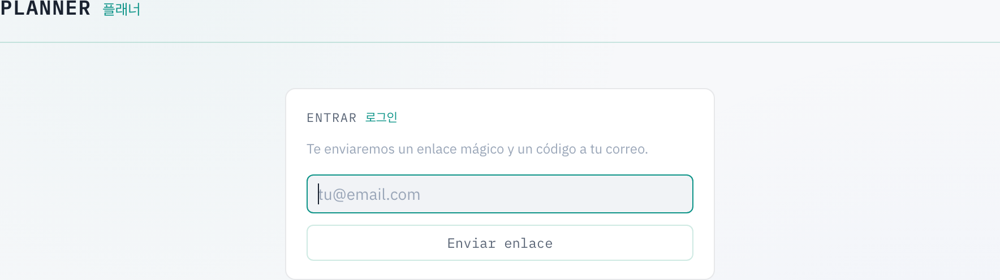
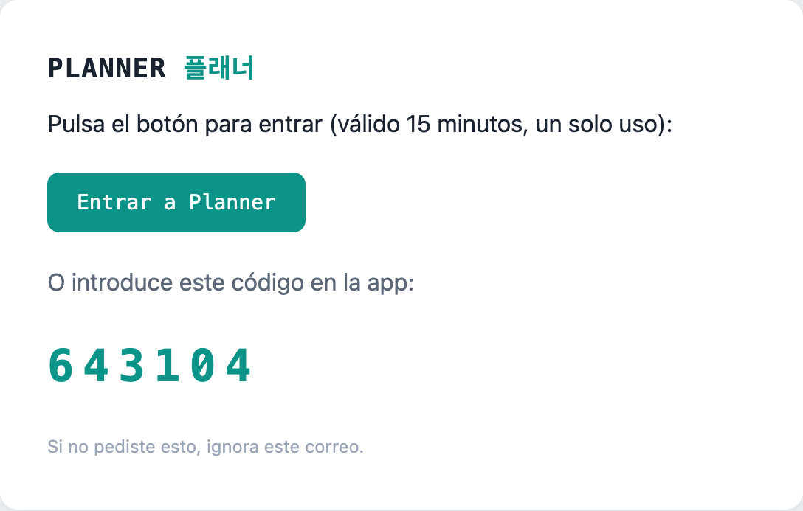
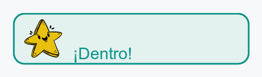
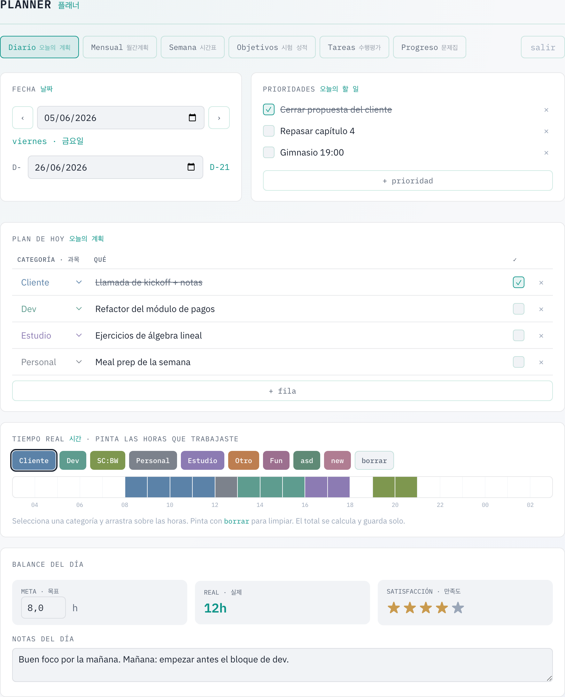
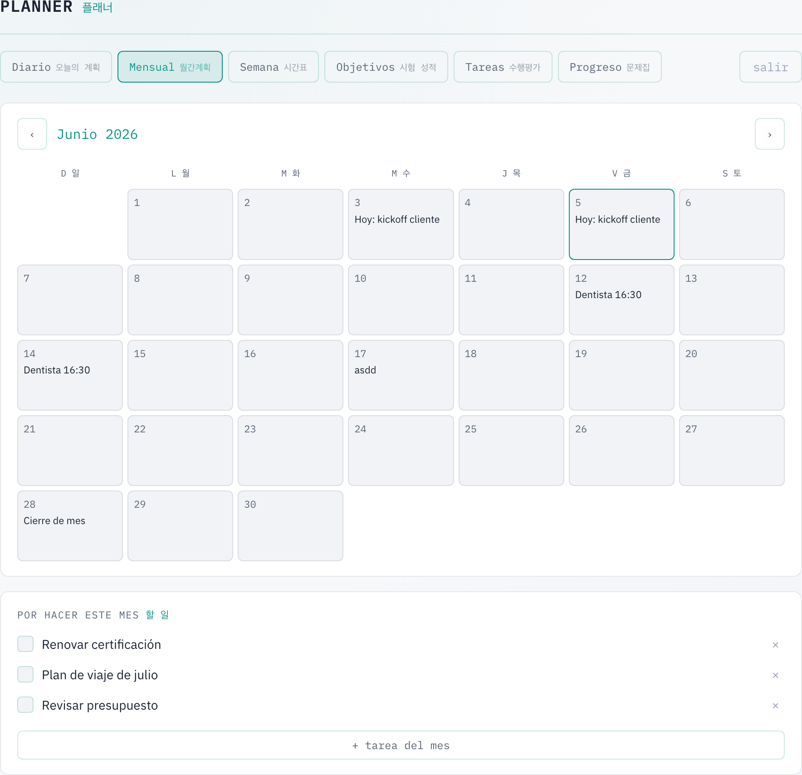
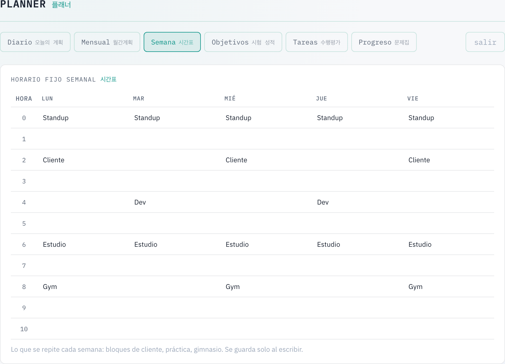
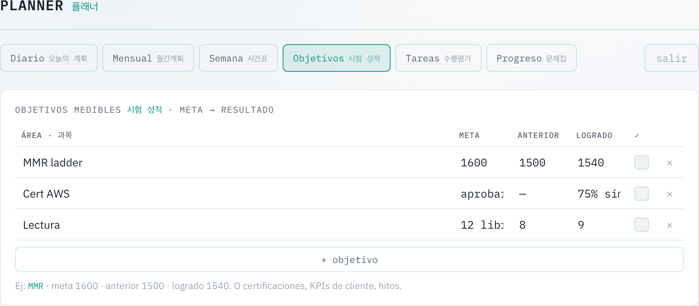
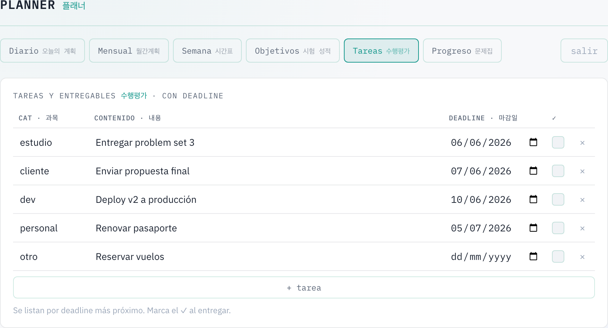
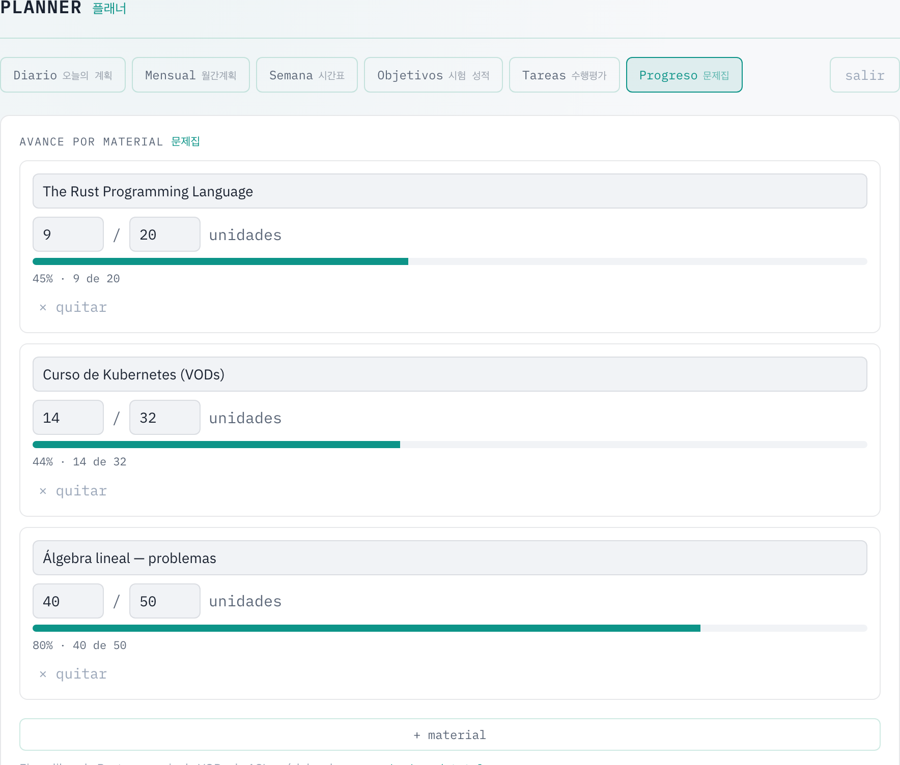
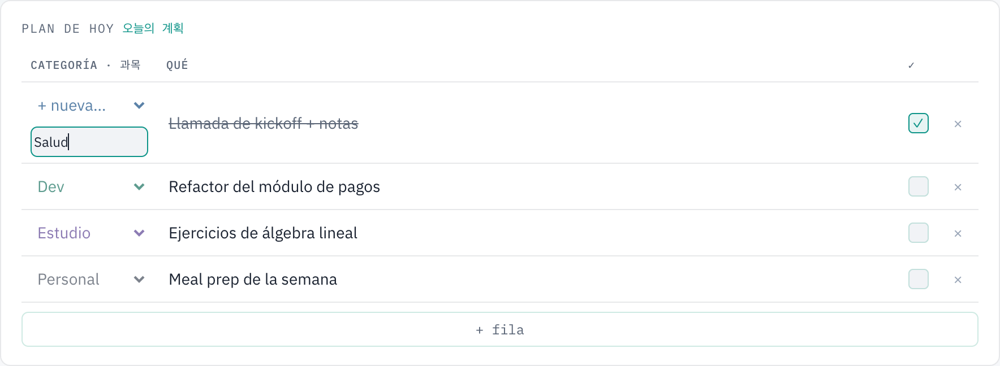

# Manual de Planner · 플래너

Guía completa de uso del planner personal. **Planner** es una app web para
organizar tu día a día: plan diario, calendario mensual, horario semanal,
objetivos, tareas y progreso de materiales. Cada persona tiene su **propio
planner privado** (sus datos no se mezclan con los de nadie).

- **URL:** https://planner.lifestyle
- Todo se **guarda solo** mientras escribes (no hay botón "Guardar").
- Funciona en computadora y móvil (diseño responsive).

---

## 1. Acceso (login)

No hay contraseñas. Entras con un **enlace mágico** y/o un **código de 6 dígitos**
que llegan a tu correo.

**Pasos:**
1. Entra a https://planner.lifestyle e introduce tu email → **Enviar enlace**.
2. Revisa tu correo (remitente *Planner <login@planner.lifestyle>*). Recibirás:
   - un **botón "Entrar a Planner"** (el enlace mágico), y
   - un **código de 6 dígitos**.
3. Pulsa el enlace **o** teclea el código en la app. Si pegas el código, el
   formulario se envía solo al completar los 6 dígitos.

> Solo los emails **autorizados** reciben el correo. Si tu email no está en la
> lista, no llega nada (y el mensaje en pantalla es el mismo, por seguridad).
> El enlace/código caduca a los **15 minutos** y es de **un solo uso**.

Así se ve el correo que recibes:

Al entrar, te recibe una estrellita en la notificación de bienvenida ⭐:

Para salir, usa el botón **salir** (arriba a la derecha del menú).

---

## 2. El menú

Arriba siempre tienes las seis secciones:

**Diario · Mensual · Semana · Objetivos · Tareas · Progreso**

La pestaña activa aparece resaltada en verde.

---

## 3. Diario 〔오늘의 계획〕

Es la pantalla principal: todo lo de **un día**.

### Fecha y navegación
- Las flechas **‹ ›** van al día anterior/siguiente; el selector de fecha salta
  a cualquier día.
- **D-** es tu **cuenta regresiva** hacia una fecha objetivo (un examen, una
  entrega, un viaje…). Eliges la fecha objetivo una vez y se muestra en todos
  los días: `D-21` (faltan 21 días), `D-DAY` (es hoy), `D+3` (pasaron 3). El
  número se actualiza solo según el día que estés viendo.

### Prioridades 〔오늘의 할 일〕
Lo más importante del día. Marca la casilla al completar (se tacha). Añade con
**+ prioridad** y elimina con la **×**.

### Plan de hoy 〔오늘의 계획〕
Filas de "qué vas a hacer", cada una con una **categoría** de color.
- **+ fila** añade una fila; la **×** la borra.
- El desplegable de categoría te deja **elegir una existente** o **crear una
  nueva al momento** ("+ nueva…"): escribes el nombre y se crea con un color
  asignado automáticamente. El texto cambia al color de la categoría.

### Tiempo real 〔시간〕 — pinta tus horas
Una barra de 24 horas (empieza a las 04:00). Selecciona una categoría en la
paleta y **arrastra** sobre las horas que trabajaste; usa **borrar** para
limpiar. El total ("real") se calcula y guarda solo. Cada categoría nueva
aparece también aquí como color para pintar.

### Balance del día
- **meta · 목표**: horas que te propones.
- **real · 실제**: horas pintadas (automático).
- **satisfacción · 만족도**: estrellas (pasa el ratón para previsualizar, clic
  para fijar).
- **Notas del día**: reflexión libre.

---

## 4. Mensual 〔월간계획〕

Calendario del mes con una **nota por día** y una lista de **pendientes del mes**.

- Las flechas cambian de mes; el día de hoy va resaltado.
- Escribe directamente en cualquier casilla del calendario (se guarda solo).
- Abajo, **+ tarea del mes** añade pendientes del mes; la **×** las quita.

---

## 5. Semana 〔시간표〕

Tu **horario fijo semanal** (lo que se repite cada semana: bloques de trabajo,
clase, gimnasio…). Lo llenas una vez y casi no lo tocas.

Escribe en cada celda (fila = franja horaria, columnas = Lun–Vie). Si dejas una
celda vacía, se borra.

---

## 6. Objetivos 〔시험 성적〕

Metas medibles: **área · meta · anterior · logrado**, con un ✓ al cumplirlas.

Ej.: *MMR · meta 1600 · anterior 1500 · logrado 1540*. También sirve para
certificaciones, KPIs, hitos. **+ objetivo** añade filas; **×** las borra.

---

## 7. Tareas 〔수행평가〕

Entregables **con fecha límite**. Se ordenan por **deadline más próximo** (las
sin fecha quedan al final). Marca el ✓ al entregar.

---

## 8. Progreso 〔문제집〕

Avance por **material / curso** con barra de porcentaje (hechas / totales).

Ej.: un libro, una serie de vídeos, módulos de un repo. Ajusta los números y la
barra se recalcula. **+ material** añade; **× quitar** elimina.

---

## 9. Categorías

Las categorías (las de colores del Plan y del pintado de horas) son **propias de
cada cuenta**.

- Una cuenta nueva empieza con tres por defecto: **Personal, Estudio, Otro**.
- Puedes **crear más** en el momento desde el desplegable del Plan ("+ nueva…"):
  aparece un campo, escribes el nombre y pulsas **Enter**.
- El color se asigna solo de una paleta armoniosa (tonos japoneses *和色*).
- La categoría queda disponible al instante en el desplegable y como color para
  pintar en "Tiempo real".

---

## 10. Tu cuenta y privacidad

- Cada cuenta es un **planner independiente**: tus días, plan, objetivos,
  tareas, materiales, notas, horario, categorías y D-day son **solo tuyos**.
- El acceso es por **lista de invitados**: solo los emails autorizados pueden
  entrar; no hay registro abierto.
- La conexión va por **HTTPS** y la sesión queda recordada en tu navegador hasta
  que pulses **salir**.

---

## 11. Cosas útiles

- **Todo se autoguarda** al escribir, marcar o pintar (no hay botón de guardar).
- Visitar una fecha **crea ese día** automáticamente (en blanco) para que puedas
  empezar a llenarlo.
- Algunos valores derivados (la cuenta D-, el % de un material, el color de una
  categoría recién elegida) se ven en vivo o, en algún caso, al **recargar**.

---

## 12. Preguntas frecuentes (FAQ)

**¿Tengo que guardar?**
No. Todo se guarda solo al escribir, marcar una casilla o pintar horas.

**No me llega el correo de acceso.**
Revisa spam/promociones. Si aun así no llega, puede que tu email **no esté
autorizado** (no hay registro abierto) — pídele al administrador que te añada.
Recuerda que el enlace/código caduca a los 15 minutos.

**Pedí el enlace pero ya caducó / lo usé.**
Vuelve a la pantalla de acceso y pide uno nuevo (cada uno invalida el anterior).

**¿Otra persona puede ver mi planner?**
No. Cada cuenta es privada: tus días, plan, objetivos, tareas, etc. son solo
tuyos. Nadie más los ve.

**¿Puedo usarlo en el móvil?**
Sí, el diseño se adapta. Para pintar las horas, arrastra el dedo sobre la barra.

**Pinté mal una hora.**
Selecciona **borrar** en la paleta y arrastra sobre las casillas a limpiar.

**Cambié la fecha objetivo (D-) y el número no se actualizó.**
Se actualiza al elegir la fecha y al navegar entre días; si no, recarga la página.

**¿Cómo cierro sesión?**
Con el botón **salir** (arriba a la derecha del menú).

**¿Se pierden mis datos si entro desde otro dispositivo?**
No. Tus datos viven en el servidor; entra con tu email desde donde quieras.

---

## Apéndice — Administración

Tareas que hoy realiza el administrador (por consola), no desde la app:

- **Autorizar a alguien:** añadir su email a la lista de cuentas.
- **Quitar acceso:** eliminar su cuenta (borra también sus datos).

Detalles técnicos (Rails 8 + Hotwire, despliegue con Kamal, auth por magic link
con Resend) están en el `README.md` del proyecto.
